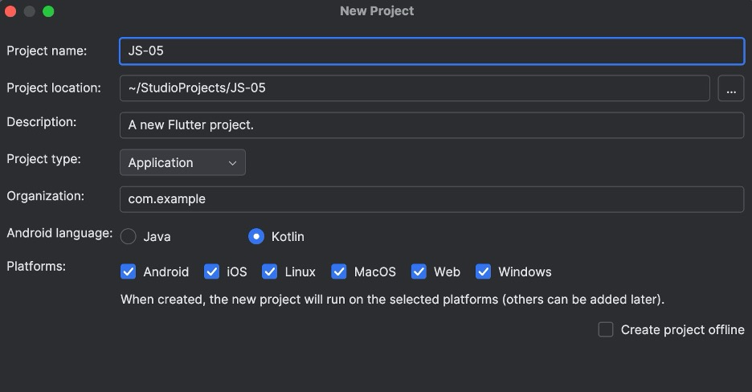
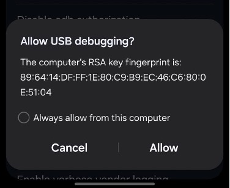
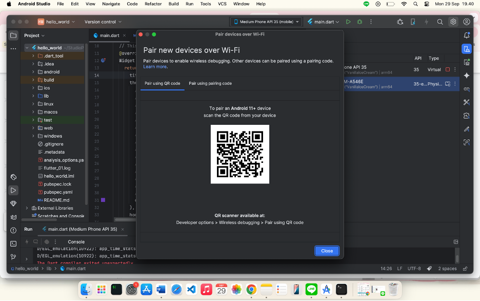
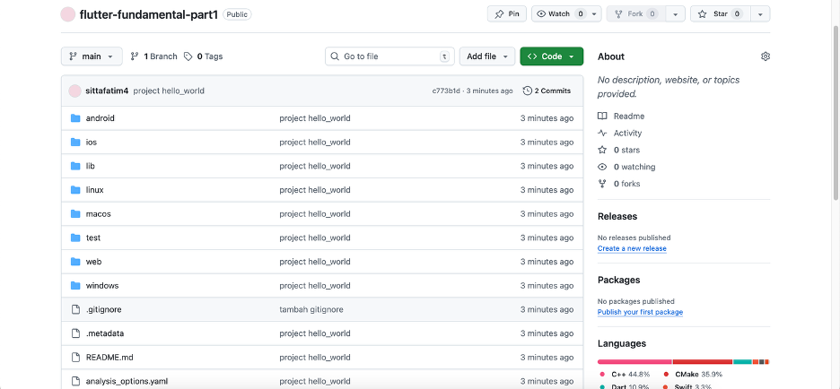
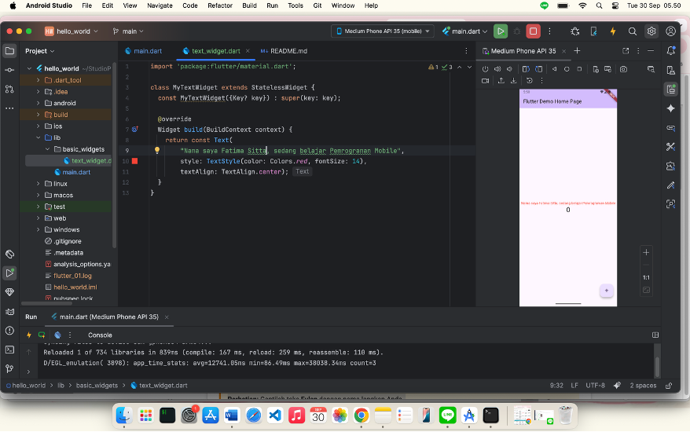
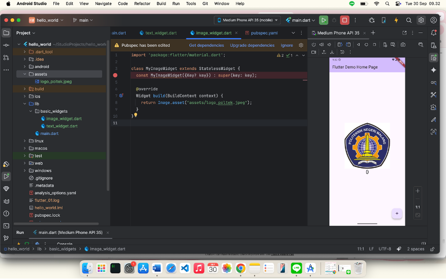
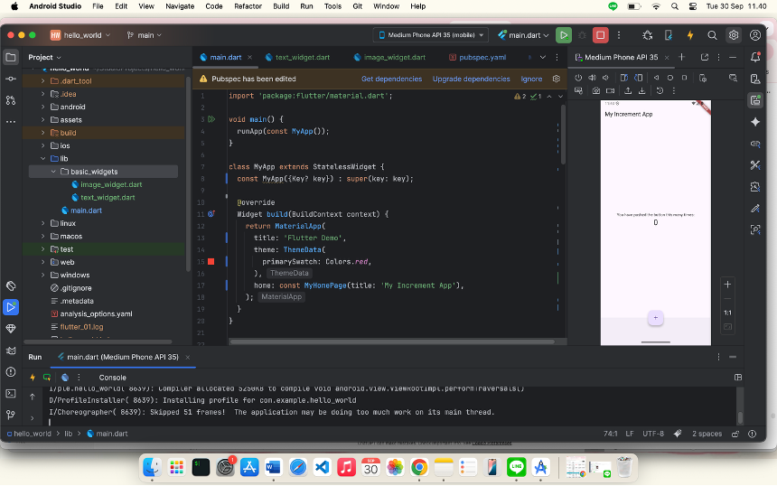
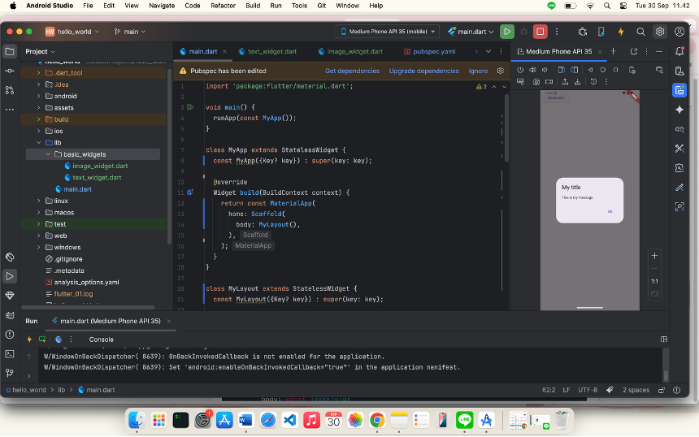
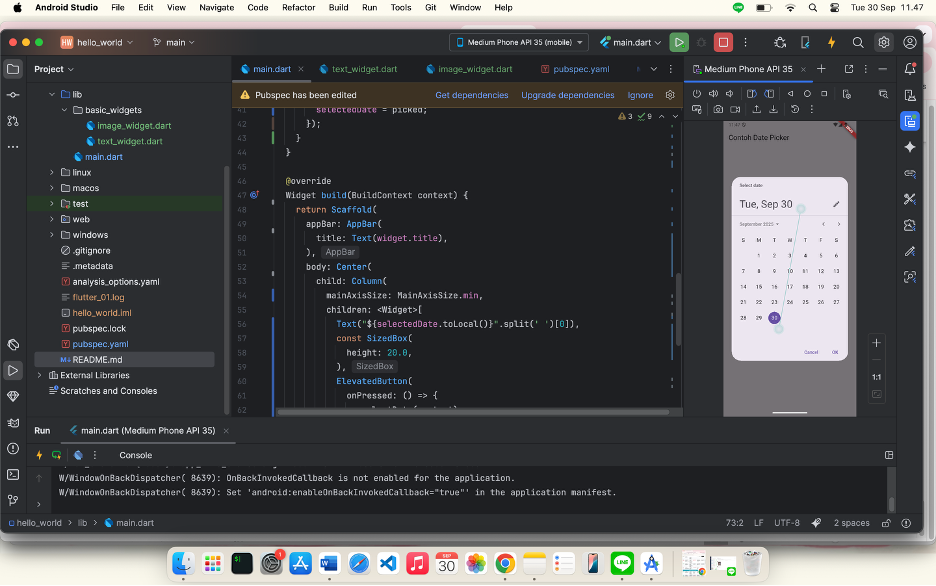

#### Nama:
#### NIM :

# 🚀 Flutter Basic Widgets Project

Proyek ini merupakan aplikasi Flutter sederhana untuk mempelajari dasar-dasar Flutter serta penerapan beberapa widget penting.

---

## 📸 Screenshot Perkembangan

### 1️⃣ Membuat Project Flutter Baru

  

### 2️⃣ Menghubungkan Perangkat Android atau Emulator

  
  

### 3️⃣ Membuat Repository GitHub dan Laporan Praktikum

  

### 4️⃣ Menerapkan Text Widget dan Image Widget

  
  

### 5️⃣ Menerapkan Scaffold Widget, Dialog Widget, Input & Selection Widget, Date & Time Pickers

  
  
  
  

